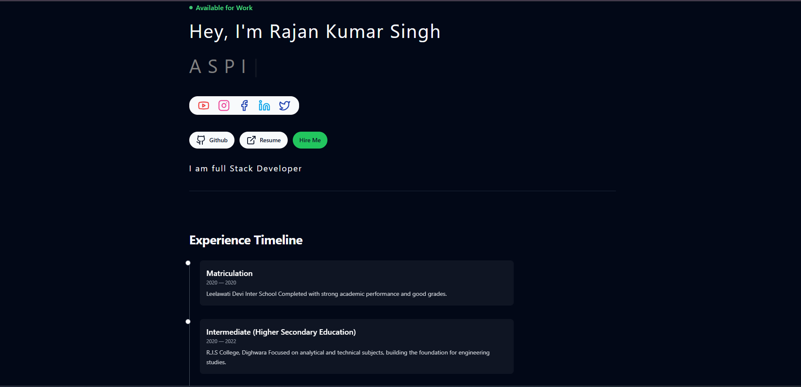
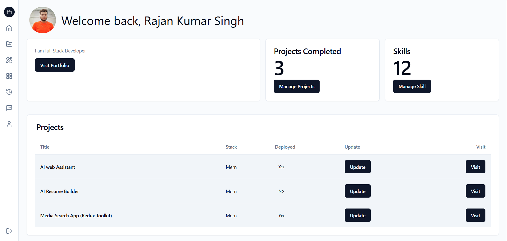
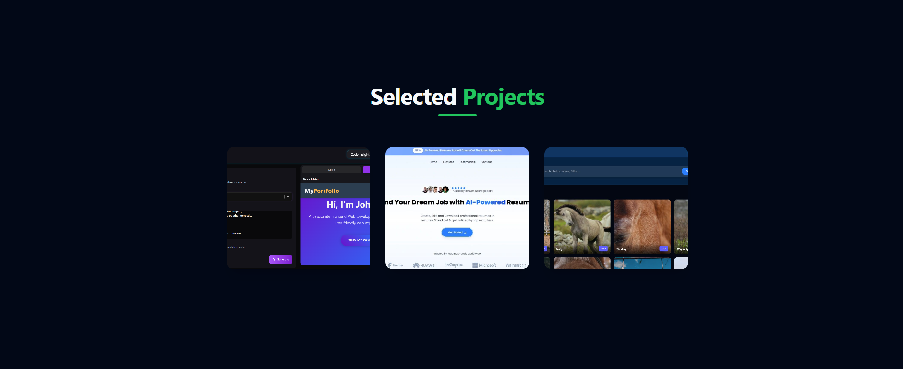

# 🚀 Rajan Kumar Singh - MERN Portfolio

A modern, fully responsive and production-ready Full Stack Developer Portfolio built using the MERN Stack with an Admin Dashboard.

---

## 🌐 Live Demo

🔗 Portfolio: https://rajankumarsingh.me/ 
🔗 Admin Dashboard: https://your-dashboard-url.vercel.app  
🔗 Backend API: https://your-backend-url.onrender.com  

---

## 👨‍💻 About The Project

This is a complete Full Stack Portfolio Website with an integrated Admin Dashboard that allows dynamic content management.

It includes authentication, protected routes, project management, Cloudinary file uploads, contact form handling, and production deployment.

Built with scalability and performance in mind.

---

## 🛠️ Tech Stack

### 🎨 Frontend
- React.js
- Tailwind CSS
- Redux Toolkit
- Axios
- React Router DOM
- Vite

### ⚙️ Backend
- Node.js
- Express.js
- MongoDB Atlas
- Mongoose
- JWT Authentication
- Cookie-based Auth
- Cloudinary

### ☁️ Deployment
- Vercel (Frontend)
- Render (Backend)
- MongoDB Atlas (Database)

---

## ✨ Core Features

✅ Fully Responsive UI  
✅ Secure JWT Authentication  
✅ Cookie-based Authorization  
✅ Admin Dashboard  
✅ Project CRUD Management  
✅ Resume & Avatar Upload (Cloudinary)  
✅ Contact Message System  
✅ Protected Routes  
✅ Production Ready Setup  
✅ Error Handling Middleware  

---

## 📸 Screenshots

### 📊 Admin Dashboard

### 📁 Projects Section

---

## 📂 Project Structure

portfolio/
│
├── frontend/
│ ├── src/
│ └── package.json
│
├── dashboard/
│ ├── src/
│ └── package.json
│
├── backend/
│ ├── controllers/
│ ├── middlewares/
│ ├── models/
│ ├── routes/
│ ├── utils/
│ └── server.js
│
├── screenshots/
│
└── README.md

---

## ⚙️ Environment Variables

Create a `.env` file in backend folder:

PORT=5000
MONGO_URI=your_mongodb_connection_string
JWT_SECRET_KEY=your_secret_key
COOKIE_EXPIRE=7
CLOUDINARY_NAME=your_cloud_name
CLOUDINARY_API_KEY=your_api_key
CLOUDINARY_API_SECRET=your_api_secret
PORTFOLIO_URL= your portfolio url
DASHBOARD_URL=https://your-dashboard-url.vercel.app

---

## 🚀 Installation Guide

### 1️⃣ Clone Repository

git clone https://github.com/rajankumarsingh01/Mern_Portfolio

---

### 2️⃣ Backend Setup

cd backend
npm install
npm run dev

---

### 3️⃣ Frontend Setup

cd frontend
npm install
npm run dev

---

### 4️⃣ Dashboard Setup

cd dashboard
npm install
npm run dev

---

## 🔐 Authentication Flow

- User Login → JWT Generated
- Token stored in HTTPOnly Cookie
- Protected Routes verified using middleware
- Production-safe cookie configuration

---

## 📈 Future Improvements

- Blog System
- Dark / Light Mode
- Role-Based Authentication
- Performance Optimization
- SEO Optimization

---

## 🤝 Connect With Me

🐙 GitHub: https://github.com/rajankumarsingh01  

---

## ⭐ Show Your Support

If you like this project:

⭐ Star the repository  
🍴 Fork it  
📢 Share it  

---
