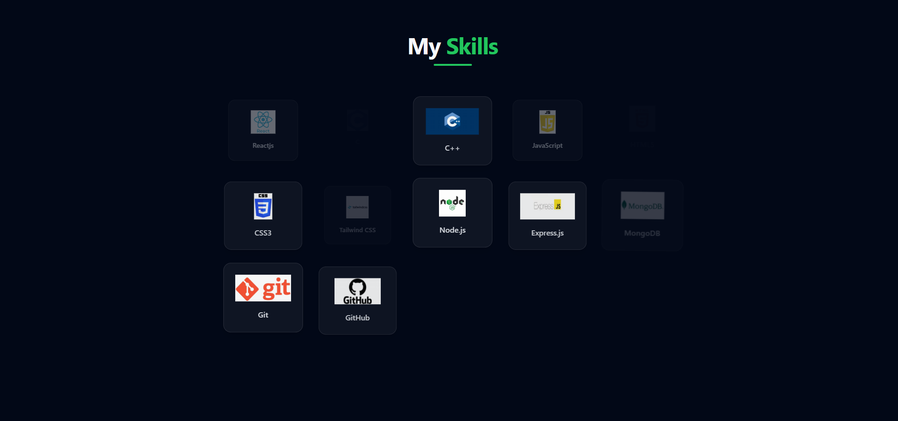

<div align="center">

# 🚀 Rajan Kumar Singh — MERN Stack Portfolio

**A production-grade Full Stack Developer Portfolio with an AI Assistant, interactive terminal, admin dashboard, and a built-in game — built on the MERN stack.**

[](https://rajankumarsingh.me/)
[](./LICENSE)
[](https://react.dev/)
[](https://nodejs.org/)
[](https://www.mongodb.com/atlas)

[Live Demo](https://rajankumarsingh.me/) · [Report Bug](https://github.com/rajankumarsingh01/Mern_Portfolio/issues) · [Request Feature](https://github.com/rajankumarsingh01/Mern_Portfolio/issues)


</div>

---

## 📖 Table of Contents

- [About The Project](#-about-the-project)
- [Live Demo](#-live-demo)
- [Key Features](#-key-features)
- [Tech Stack](#️-tech-stack)
- [Screenshots](#-screenshots)
- [Project Structure](#-project-structure)
- [Getting Started](#-getting-started)
- [Environment Variables](#️-environment-variables)
- [Authentication Flow](#-authentication-flow)
- [Roadmap](#-roadmap)
- [Contributing](#-contributing)
- [License](#-license)
- [Contact](#-contact)
- [Show Your Support](#-show-your-support)

---

## 👨‍💻 About The Project

This is a complete **Full Stack Portfolio Platform**, not just a static site — it ships with its own **Admin Dashboard** for dynamic content management, a **MongoDB-backed API**, secure **JWT authentication**, and a set of interactive frontend experiences (AI chatbot, terminal emulator, and a mini-game) layered on top of a clean, responsive UI.

It's built with production concerns in mind: rate limiting, XSS/NoSQL-injection sanitization, secure cookie-based auth, and a deployed CI-friendly build pipeline (Vercel + Render + MongoDB Atlas).

---

## 🌐 Live Demo

🔗 **Portfolio:** [https://rajankumarsingh.me/](https://rajankumarsingh.me/)

---

## ✨ Key Features

#### Core Platform
- ✅ Fully responsive, modern UI (Tailwind CSS + Framer Motion)
- ✅ Secure JWT authentication with HTTPOnly cookies
- ✅ Admin Dashboard with full Project CRUD
- ✅ Resume & avatar uploads via Cloudinary
- ✅ Contact message system with email notifications (Nodemailer)
- ✅ Protected routes & role-based middleware
- ✅ Rate limiting, Helmet, XSS-clean, Mongo sanitize for security
- ✅ Production-ready error handling middleware

#### Interactive Experiences
- 🤖 **ARIA** — an AI-powered chatbot assistant embedded in the portfolio
- 💻 **Interactive Terminal** — a mock dev terminal for exploring the site in a CLI-style UX
- 🎮 **Mini Game** — a dev-themed arcade game with a level-up system, built directly into the UI
- 📝 Markdown-powered blog/content rendering (`react-markdown`)
- 🎨 3D visuals via `@react-three/fiber` and `three.js`

---

## 🛠️ Tech Stack

**Frontend — Portfolio (`/portfolio`)**
`React 18` · `Vite` · `Tailwind CSS` · `Framer Motion` · `React Router DOM` · `React Hook Form + Zod` · `Radix UI` · `Three.js / React Three Fiber` · `Firebase` · `Axios`

**Frontend — Admin Dashboard (`/dashboard`)**
`React 18` · `Vite` · `Redux Toolkit` · `Recharts` · `Radix UI` · `Tailwind CSS`

**Backend (`/backend`)**
`Node.js` · `Express.js` · `MongoDB Atlas + Mongoose` · `JWT` · `Cookie-based Auth` · `Cloudinary` · `Nodemailer` · `Helmet` · `express-rate-limit` · `express-mongo-sanitize` · `xss-clean` · `hpp`

**Deployment**
`Vercel` (Frontend + Dashboard) · `Render` (Backend) · `MongoDB Atlas` (Database)

---

## 📸 Screenshots

| Home | Dashboard |
|---|---|
|  |  |

### 📁 Projects Section


---

## 📂 Project Structure

```
Mern_Portfolio/
│
├── portfolio/              # Public-facing portfolio (React + Vite)
│   ├── src/
│   │   ├── components/
│   │   │   ├── game/        # Built-in arcade game
│   │   │   └── terminal/    # Interactive terminal UI
│   │   ├── pages/           # ARIA AI assistant & page routes
│   │   └── ...
│   └── package.json
│
├── dashboard/               # Admin dashboard (React + Vite + Redux)
│   ├── src/
│   └── package.json
│
├── backend/                 # REST API (Node.js + Express)
│   ├── controller/
│   ├── middlewares/
│   ├── models/
│   ├── routes/
│   ├── utils/
│   └── server.js
│
├── screenshots/
├── LICENSE
└── README.md
```

---

## 🚀 Getting Started

### Prerequisites
- Node.js ≥ 18
- A MongoDB Atlas connection string
- A Cloudinary account (for uploads)

### 1️⃣ Clone the Repository
```bash
git clone https://github.com/rajankumarsingh01/Mern_Portfolio.git
cd Mern_Portfolio
```

### 2️⃣ Backend Setup
```bash
cd backend
npm install
npm run dev
```

### 3️⃣ Portfolio (Frontend) Setup
```bash
cd portfolio
npm install
npm run dev
```

### 4️⃣ Dashboard Setup
```bash
cd dashboard
npm install
npm run dev
```

---

## ⚙️ Environment Variables

Create a `.env` file inside `backend/`:

```env
PORT=5000
MONGO_URI=your_mongodb_connection_string
JWT_SECRET_KEY=your_secret_key
COOKIE_EXPIRE=7
CLOUDINARY_NAME=your_cloud_name
CLOUDINARY_API_KEY=your_api_key
CLOUDINARY_API_SECRET=your_api_secret
PORTFOLIO_URL=your_portfolio_url
DASHBOARD_URL=https://your-dashboard-url.vercel.app
SMTP_HOST=your_smtp_host
SMTP_PORT=your_smtp_port
SMTP_MAIL=your_email
SMTP_PASSWORD=your_email_app_password
```

> ⚠️ Never commit your real `.env` file. Use `.env.example` as a template for contributors.

---

## 🔐 Authentication Flow

1. User logs in → server generates a JWT
2. Token is stored in an **HTTPOnly, Secure cookie**
3. Protected routes verify the token via middleware on every request
4. Production-safe cookie config (`SameSite`, `Secure`) for cross-origin deployment

---

## 🗺️ Roadmap

- [ ] Full blog system with commenting
- [ ] Dark / Light theme toggle
- [ ] Role-based access control (multi-admin support)
- [ ] Code-splitting for smaller production bundles
- [ ] SEO optimization (meta tags, sitemap, structured data)
- [ ] Unit & integration test coverage

---

## 🤝 Contributing

Contributions make the open-source community amazing. Any contributions are **greatly appreciated**.

1. Fork the repository
2. Create your feature branch (`git checkout -b feature/AmazingFeature`)
3. Commit your changes (`git commit -m 'Add some AmazingFeature'`)
4. Push to the branch (`git push origin feature/AmazingFeature`)
5. Open a Pull Request

---

## 📄 License

Distributed under the **MIT License**. See [`LICENSE`](./LICENSE) for full text.

---

## 📬 Contact

**Rajan Kumar Singh**

🐙 GitHub: [@rajankumarsingh01](https://github.com/rajankumarsingh01)
🌐 Portfolio: [rajankumarsingh.me](https://rajankumarsingh.me/)

---

## ⭐ Show Your Support

If this project helped you or you just like it:

⭐ Star the repository
🍴 Fork it
📢 Share it with others

<div align="center">

Made with ❤️ using the MERN Stack

</div>